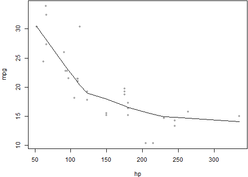

# A Minimal Example for Markdown

This is a minimal example of using **knitr** to produce an _HTML_ page from _Markdown_.


```r
require(rCharts)
options(RCHART_WIDTH = 600, RCHART_HEIGHT = 400)
r1 <- rPlot(mpg ~ wt | am + vs, data = mtcars, type = "point")
r1$print("chart1", include_assets = T, cdn = T)
```

<script type='text/javascript' src=http://ramnathv.github.io/rCharts/libraries/widgets/polycharts/js/polychart2.standalone.js></script> 
 <style>
  .rChart {
    display: block;
    margin-left: auto; 
    margin-right: auto;
    width: 600px;
    height: 400px;
  }  
  </style>
<div id = 'chart1' class = 'rChart polycharts'></div>
<script type='text/javascript'>
    var chartParams = {
 "dom": "chart1",
"width":    600,
"height":    400,
"layers": [
 {
 "x": "wt",
"y": "mpg",
"data": {
 "mpg": [     21,     21,   22.8,   21.4,   18.7,   18.1,   14.3,   24.4,   22.8,   19.2,   17.8,   16.4,   17.3,   15.2,   10.4,   10.4,   14.7,   32.4,   30.4,   33.9,   21.5,   15.5,   15.2,   13.3,   19.2,   27.3,     26,   30.4,   15.8,   19.7,     15,   21.4 ],
"cyl": [      6,      6,      4,      6,      8,      6,      8,      4,      4,      6,      6,      8,      8,      8,      8,      8,      8,      4,      4,      4,      4,      8,      8,      8,      8,      4,      4,      4,      8,      6,      8,      4 ],
"disp": [    160,    160,    108,    258,    360,    225,    360,  146.7,  140.8,  167.6,  167.6,  275.8,  275.8,  275.8,    472,    460,    440,   78.7,   75.7,   71.1,  120.1,    318,    304,    350,    400,     79,  120.3,   95.1,    351,    145,    301,    121 ],
"hp": [    110,    110,     93,    110,    175,    105,    245,     62,     95,    123,    123,    180,    180,    180,    205,    215,    230,     66,     52,     65,     97,    150,    150,    245,    175,     66,     91,    113,    264,    175,    335,    109 ],
"drat": [    3.9,    3.9,   3.85,   3.08,   3.15,   2.76,   3.21,   3.69,   3.92,   3.92,   3.92,   3.07,   3.07,   3.07,   2.93,      3,   3.23,   4.08,   4.93,   4.22,    3.7,   2.76,   3.15,   3.73,   3.08,   4.08,   4.43,   3.77,   4.22,   3.62,   3.54,   4.11 ],
"wt": [   2.62,  2.875,   2.32,  3.215,   3.44,   3.46,   3.57,   3.19,   3.15,   3.44,   3.44,   4.07,   3.73,   3.78,   5.25,  5.424,  5.345,    2.2,  1.615,  1.835,  2.465,   3.52,  3.435,   3.84,  3.845,  1.935,   2.14,  1.513,   3.17,   2.77,   3.57,   2.78 ],
"qsec": [  16.46,  17.02,  18.61,  19.44,  17.02,  20.22,  15.84,     20,   22.9,   18.3,   18.9,   17.4,   17.6,     18,  17.98,  17.82,  17.42,  19.47,  18.52,   19.9,  20.01,  16.87,   17.3,  15.41,  17.05,   18.9,   16.7,   16.9,   14.5,   15.5,   14.6,   18.6 ],
"vs": [      0,      0,      1,      1,      0,      1,      0,      1,      1,      1,      1,      0,      0,      0,      0,      0,      0,      1,      1,      1,      1,      0,      0,      0,      0,      1,      0,      1,      0,      0,      0,      1 ],
"am": [      1,      1,      1,      0,      0,      0,      0,      0,      0,      0,      0,      0,      0,      0,      0,      0,      0,      1,      1,      1,      0,      0,      0,      0,      0,      1,      1,      1,      1,      1,      1,      1 ],
"gear": [      4,      4,      4,      3,      3,      3,      3,      4,      4,      4,      4,      3,      3,      3,      3,      3,      3,      4,      4,      4,      3,      3,      3,      3,      3,      4,      5,      5,      5,      5,      5,      4 ],
"carb": [      4,      4,      1,      1,      2,      1,      4,      2,      2,      4,      4,      3,      3,      3,      4,      4,      4,      1,      2,      1,      1,      2,      2,      4,      2,      1,      2,      2,      4,      6,      8,      2 ] 
},
"facet": [ "am", "vs" ],
"type": "point" 
} 
],
"facet": {
 "type": "grid",
"x": "am",
"y": "vs" 
},
"guides": [],
"coord": [],
"id": "chart1" 
}
    _.each(chartParams.layers, function(el){
        el.data = polyjs.data(el.data)
    })
    var graph_chart1 = polyjs.chart(chartParams);
</script>


<style>.rChart{width: 600px; height: 400px;}</style>

## Google Vis


```r
require(googleVis)
```

```
Loading required package: googleVis

Welcome to googleVis version 0.4.7

Please read the Google API Terms of Use
before you use the package:
https://developers.google.com/terms/

Note, the plot method of googleVis will by default use
the standard browser to display its output.

See the googleVis package vignette for more details.

To suppress the this message use:
suppressPackageStartupMessages(library(googleVis))
```

```r
options(gvis.plot.tag = "chart")
M1 <- gvisMotionChart(Fruits, idvar = "Fruit", timevar = "Year")
plot(M1)
```

<!-- MotionChart generated in R 3.0.2 by googleVis 0.4.7 package -->
<!-- Tue Feb 04 14:08:11 2014 -->


<!-- jsHeader -->
<script type="text/javascript">
 
// jsData 
function gvisDataMotionChartID3ccc12db137 () {
var data = new google.visualization.DataTable();
var datajson =
[
 [
 "Apples",
2008,
"West",
98,
78,
20,
"2008-12-31" 
],
[
 "Apples",
2009,
"West",
111,
79,
32,
"2009-12-31" 
],
[
 "Apples",
2010,
"West",
89,
76,
13,
"2010-12-31" 
],
[
 "Oranges",
2008,
"East",
96,
81,
15,
"2008-12-31" 
],
[
 "Bananas",
2008,
"East",
85,
76,
9,
"2008-12-31" 
],
[
 "Oranges",
2009,
"East",
93,
80,
13,
"2009-12-31" 
],
[
 "Bananas",
2009,
"East",
94,
78,
16,
"2009-12-31" 
],
[
 "Oranges",
2010,
"East",
98,
91,
7,
"2010-12-31" 
],
[
 "Bananas",
2010,
"East",
81,
71,
10,
"2010-12-31" 
] 
];
data.addColumn('string','Fruit');
data.addColumn('number','Year');
data.addColumn('string','Location');
data.addColumn('number','Sales');
data.addColumn('number','Expenses');
data.addColumn('number','Profit');
data.addColumn('string','Date');
data.addRows(datajson);
return(data);
}
 
// jsDrawChart
function drawChartMotionChartID3ccc12db137() {
var data = gvisDataMotionChartID3ccc12db137();
var options = {};
options["width"] =    600;
options["height"] =    500;

    var chart = new google.visualization.MotionChart(
    document.getElementById('MotionChartID3ccc12db137')
    );
    chart.draw(data,options);
    

}
  
 
// jsDisplayChart
(function() {
var pkgs = window.__gvisPackages = window.__gvisPackages || [];
var callbacks = window.__gvisCallbacks = window.__gvisCallbacks || [];
var chartid = "motionchart";
  
// Manually see if chartid is in pkgs (not all browsers support Array.indexOf)
var i, newPackage = true;
for (i = 0; newPackage && i < pkgs.length; i++) {
if (pkgs[i] === chartid)
newPackage = false;
}
if (newPackage)
  pkgs.push(chartid);
  
// Add the drawChart function to the global list of callbacks
callbacks.push(drawChartMotionChartID3ccc12db137);
})();
function displayChartMotionChartID3ccc12db137() {
  var pkgs = window.__gvisPackages = window.__gvisPackages || [];
  var callbacks = window.__gvisCallbacks = window.__gvisCallbacks || [];
  window.clearTimeout(window.__gvisLoad);
  // The timeout is set to 100 because otherwise the container div we are
  // targeting might not be part of the document yet
  window.__gvisLoad = setTimeout(function() {
  var pkgCount = pkgs.length;
  google.load("visualization", "1", { packages:pkgs, callback: function() {
  if (pkgCount != pkgs.length) {
  // Race condition where another setTimeout call snuck in after us; if
  // that call added a package, we must not shift its callback
  return;
}
while (callbacks.length > 0)
callbacks.shift()();
} });
}, 100);
}
 
// jsFooter
</script>
 
<!-- jsChart -->  
<script type="text/javascript" src="https://www.google.com/jsapi?callback=displayChartMotionChartID3ccc12db137"></script>
 
<!-- divChart -->
  
<div id="MotionChartID3ccc12db137"
  style="width: 600px; height: 500px;">
</div>


## R code chunks


```r
# set global chunk options: images will be 7x5 inches
opts_chunk$set(fig.width = 7, fig.height = 5)
```


Now we write some code chunks in this markdown file:
  

```r
x <- 1 + 1  # a simple calculator
set.seed(123)
rnorm(5)  # boring random numbers
```

```
## [1] -0.56048 -0.23018  1.55871  0.07051  0.12929
```


We can also produce plots:
  

```r
par(mar = c(4, 4, 0.1, 0.1))
with(mtcars, {
    plot(mpg ~ hp, pch = 20, col = "darkgray")
    lines(lowess(hp, mpg))
})
```

 


## Inline code

Inline R code is also supported, e.g. the value of `x` is 2, and 2 &times; &pi;
= 6.2832.

## Math

LaTeX math as usual: $f(\alpha, \beta) \propto x^{\alpha-1}(1-x)^{\beta-1}$.

## Misc

You can indent code chunks so they can nest within other environments such as lists.

1. the area of a circle with radius x
   
   ```r
   pi * x^2
   ```
   
   ```
   ## [1] 12.57
   ```

2. OK, that is great

To compile me, use


```r
library(knitr)
knit("knitr-minimal.Rmd")
```


## Conclusion

Markdown is super easy to write. Go to **knitr** [homepage](http://yihui.name/knitr) for details.
